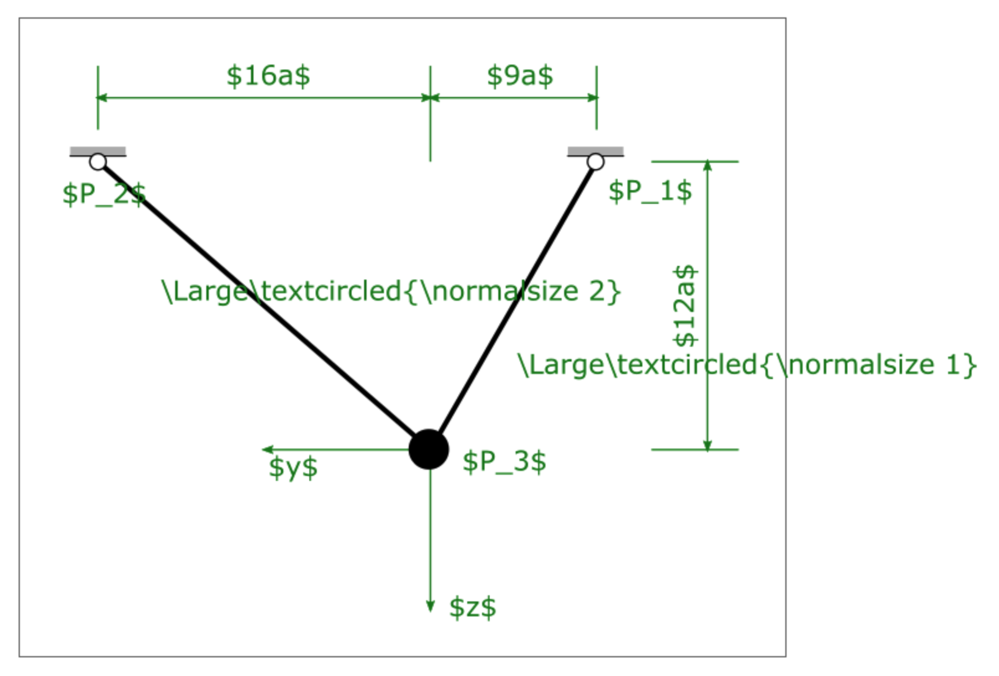

# Einfuehrung

## Links

[Documentation](https://www.overleaf.com/learn/latex/Main_Page)

## Nutzung und Installation

Es gibt für LaTeX mittlerweile zwei prinzipielle Möglichkeiten:

- online im Webbrowser

    [Overleaf, Online LaTeX Editor](https://www.overleaf.com/)

- Installation auf dem eigenen Rechner
    - Windows

        [Home - MiKTeX.org](https://miktex.org/)

    - Mac

        [MacTeX - TeX Users Group](https://tug.org/mactex/)

    - Linux

        [ubuntuusers.de](https://wiki.ubuntuusers.de/TeX_Live/)

Für uns ist im Moment die Nutzung online am einfachsten und sehr direkt umsetzbar. Daher bitte bei overleaf einen Account (kostenlos) anlegen. Dann kann es losgehen ...

## Ein erstes "Hallo Welt"

```latex
\documentclass{article}

\begin{document}
    Hallo Welt.
\end{document}
```

```{figure} Einfuehrung/Untitled.png 
--- 
width: 500px 
name: Untitled
--- 
caption 
``` 

### \documentclass - Dokumentklassen

`article` - für kleinere Texte, beinhaltet keine Kapitelüberschriften

`report` - Berichte, Abschlussarbeiten, beinhaltet Kapitelüberschriften

`book` - umfangreiche Texte, beinhaltet Kapitelüberschriften und ist standardmäßig zweiseitig

Es gibt ähnliche Klassen, die zum modernen und weitverbreiteten KOMA-Skript gehören. Diese lauten dann:

`scrartcl`

`scrreprt`

`scrbook`

Wir werden im weiteren Verlauf vor allem auf `scrreprt` setzen, da diese Klasse nahe einer Abschlussarbeit kommt und damit gut zu uns passt.

Es gibt noch weitere Klassen zum Schreiben von Briefen (dinbrief) o.ä., die wir hier aber nicht genauer betrachten wollen. Ist der Einstieg in LaTeX geschafft, kann man diese auch schnell selbst einbinden.

## Dokumentstruktur

### Seitenränder

TODO

### Absätze und Zeilenumbrüche

Absätze dienen der Struktur des Fließtextes. Sie sind das einzige Mittel, um Fließtext umzubrechen. Manuelle Zeilenumbrüche führen zu schlechten Textbildern.

### Überschriftsebenen

- es gibt maximal drei nummerierte Ebenen für die Dokumentstruktur
- article-Klassen:

```latex
\section{Überschrift}
\subsection{Unterüberschrift}
\subsubsection{Unterunterüberschrift}
\paragraph{Letzte Chance}
```

```{figure} Einfuehrung/Untitled_1.png 
--- 
width: 500px 
name: Untitled_1
--- 
caption 
``` 

- report/book-Klassen:

```latex
\chapter{Kapitelüberschrift}
\section{Überschrift}
\subsection{Unterüberschrift}
\subsubsection{Unterunterüberschrift}
\paragraph{Letzte Chance}
```

```{figure} Einfuehrung/Untitled_2.png 
--- 
width: 500px 
name: Untitled_2
--- 
caption 
``` 

### Inhaltsverzeichnis

```latex
\begin{document}

%...

\tableofcontents % Inhaltsverzeichnis
\listoffigures % Abbildungsverzeichnis
```

```{figure} Einfuehrung/Untitled_3.png 
--- 
width: 500px 
name: Untitled_3
--- 
caption 
``` 

```{figure} Einfuehrung/Untitled_4.png 
--- 
width: 500px 
name: Untitled_4
--- 
caption 
``` 

weiter unten noch etwas mehr dazu ... 

## Bilder einfügen

### Allgemeines

Das Einfügen von Bildern ist in LaTeX besonders einfach und ungewohnt (wenn man Word gewohnt ist) zugleich. **EINFACH** - da LaTeX die Aufgabe übernimmt, das Bild vernünftig zum Text zu positionieren. **UNGEWOHNT** - da LaTEX die Aufgabe übernimmt, das Bild vernünftig zum Text zu positionieren. Daher der Rat: Erzwingen Sie nichts, sondern vertrauen Sie LaTeX.

Generell gilt für eine gute Bildposition im wissenschaftlichen Text:

- Bilder werden nicht vom Text umflossen, sondern nehmen als Objekt die gesamte Textbreite ein
- Bilder sollten am unteren oder oberen Rand der Seite positioniert werden, um den Textfluss nicht zu stören.
- Bilder sollten, wenn möglich, die Textbreite nutzen. Eventuell auch mehrere Bilder in einer Abbildungsumgebung unterbringen, wenn es inhaltlich sinnvoll ist.

    ```latex
    \documentclass...

    \usepackage{graphicx} % Grafiken einbinden

    %...
    ... Ut enim ad minim veniam, quis nostrud exercitation ullamco laboris nisi ut aliquid ex ea commodi consequat (s. Abb. \ref{fig:bildlabel}). 
    %
    \begin{figure}[!h] %Postionsangabe
        \centering
        \includegraphics[width=60mm]{dependency.png}
        \caption{Ein Bild zur Digitalisierung. Quelle: xkcd.com}
        \label{fig:bildlabel}
    \end{figure}
    %
    Quis aute iure reprehenderit in voluptate velit esse cillum dolore eu fugiat nulla pariatur. Excepteur sint obcaecat cupiditat non proident, sunt in culpa qui officia deserunt mollit anim id est laborum.
    %...

    ```

```{figure} Einfuehrung/Untitled_5.png 
--- 
width: 500px 
name: Untitled_5
--- 
caption 
``` 

Die Befehle `\label` und `\ref` dienen hier zur Referenzierung des Bildes. Es wird ein eindeutiges Label vergeben, welches dann überall im Text als Referenz wieder abgerufen werden kann. Dieser Mechanismus gilt nicht für Abbildungen, sondern auch Tabellen, Gleichungen, etc.

Mit der Positionsangabe `[!h]` kann man LaTeX Hinweise zu den Positionswünschen übermitteln. Möglich sind:

- `h` - here - bitte versuche es genau an dieser Textstelle
- `t` - top - wenn möglich an Oberkante der Seite
- `b` - bottom - wenn möglich, an Unterkante der Seite
- `p` - page - nutze eine extra Seite für die Bilder

Mit dem `!` erhöht man die Priorität seiner Forderung, man "zwingt" LaTeX zur Umsetzung.

### Bilderunterschriften in schick

Natürlich kann man in LaTeX auch Dinge anpassen. Beispielsweise die Bildbeschriftung lässt sich über ein zusätzliches Package "caption" einstellen:

```latex
...
\usepackage{caption}
\captionsetup{labelfont=bf,font=small,textfont=it}
...
\begin{document}
...
```

vorher:

```{figure} Einfuehrung/Untitled_6.png 
--- 
width: 500px 
name: Untitled_6
--- 
caption 
``` 

nachher (mit caption-Package):

```{figure} Einfuehrung/Untitled_7.png 
--- 
width: 500px 
name: Untitled_7
--- 
caption 
``` 

### Bilder mit LaTeX-Schrift 

Es gibt die Möglichkeit, dass in Inkscape erstellte Bild in LaTeX einzubinden und den Text von LaTeX rendern zu lassen. Damit wird die Schriftart und Größe mit dem Dokument übereinstimmen. Dabei gibt es zwei verschiedene Varianten:

1. `.pdf_tex` (zwei Dateien: Bild als .pdf und Text als .pdf_tex)
1. `.svg` (eine Datei)

```{figure} Einfuehrung/LaTeX-Bild-InkscapeOriginal.png 
--- 
width: 300px 
name: LaTeX-Bild-InkscapeOriginal
--- 
So sieht die Grafik in Inkscape aus 
``` 

```{figure} Einfuehrung/LaTeX-Bild-LaTeX_output.png 
--- 
width: 300px 
name: LaTeX-Bild-InkscapeOriginal
--- 
So sieht die Grafik in LaTeX aus 
``` 


#### (mit `.pdf_tex`)

**Erstellen der Grafik:**

- Erstellen der Grafik mit Text, wobei LaTeX-Notation für mathematische Zeichen angegeben wird
- Anschließend wird die Abbildung als .pdf abspeichert ...
- Im Speicherdialog die `Text in PDF weglassen und LaTeX Datei erstellen` auswählen 

```{image} Einfuehrung/Untitled_8.png 
--- 
width: 500px 
name: Untitled_8
``` 

- Die zwei erstellen Dateien (`.pdf_latex` und die `.pdf`) in dem Ordner wo sich die LaTeX Dokumente befinden kopieren

In unserem Beispiel sieht die Grafik dan so aus:

```{figure} Einfuehrung/Untitled_9.png 
--- 
width: 500px 
name: Untitled_9
--- 
Original Inkscape Grafik 
``` 


**Einbinden in LaTeX:**

Liegen die Datein im gleichen Ordner, erfolgt die Einbindung wie folgt:

```latex
...
\usepackage{color} %Nutzung von Farbe
...
\begin{figure}[!h]
    \centering
    \def\svgwidth{0.7\textwidth} 
    \input{Skizze.pdf_tex}
    \caption{Quis aute iure reprehenderit in voluptate velit esse cillum dolore eu fugiat nulla pariatur.}
    \label{fig:skizze}
\end{figure}
...
```

Wenn die zwei Dateien z.B. wie hier in dem Ordner `Abbildungen` liegt, müsste dies wie folgt angegeben werden:

```latex
...
\usepackage{color} %Nutzung von Farbe
...
\begin{figure}[!h]
    \centering
    \def\svgwidth{0.7\textwidth} 
    \graphicspath{{Abbildungen/}}
    \input{Abbildungen/Skizze.pdf_tex}
    \caption{Quis aute iure reprehenderit in voluptate velit esse cillum dolore eu fugiat nulla pariatur.}
    \label{fig:skizze}
\end{figure}
...
```

So würde dann die Grafik aussehen:

```{figure} Einfuehrung/Untitled_10.png 
--- 
width: 500px 
name: Untitled_10
--- 
So würde das Bild in LaTeX aussehen 
``` 

Den Vorteil dieser Methode wird noch mal deutlich wenn man die Bilder skaliert und sieht wie die Schriftgröße dabei immer gleich bleibt:


```latex
...
\usepackage{color} %Nutzung von Farbe
...
\begin{figure}[!h]
    \centering
    \def\svgwidth{0.35\textwidth} % erstes Bild
    \input{Skizze.pdf_tex}
    \def\svgwidth{0.55\textwidth} % zweites Bild
    \input{Skizze.pdf_tex}
    \caption{Quis aute iure reprehenderit in voluptate velit esse cillum dolore eu fugiat nulla pariatur.}
    \label{fig:skizze}
\end{figure}
```

Dabei würde hier folgendes Bild erstellt  werden:

```{figure} Einfuehrung/Untitled_11.png 
--- 
width: 500px 
name: Untitled_11
--- 
Die Schriftgröße bleibt gleich, egal wie groß das Bild skaliert wird 
``` 

####  mit `.svg`

In der zweiten Variante wird die Grafik direkt als `.svg` gespeichert (es wird also nur eine Datei erzeugt). Der Nachteil an dieser Variante ist, dass die Farben nicht übernommen werden und als `LaTeX-Notation` z.B. mit `$\color{red}text$` ausgegeben werden müssen.  

```{figure} Einfuehrung/LaTeXsvgInkscapeoriginal.png
--- 
width: 500px 
name: Untitled_11
--- 
So sieht das original Inkscape Bild aus
``` 


In LaTeX sieht der Code dann wie folgt aus:

```latex
...
\usepackage{svg} %Einbindung von svg Grafiken
...
\begin{figure}[!h] 
    \centering
    \includesvg[width=120mm]{Beispiel.svg}
    \caption{Beispiel Vektorgrafik mit LaTeX rendering}
    \label{fig:Beispiel_Vektor}
\end{figure}
```

So sieht es dann in LaTeX aus:

```{figure} Einfuehrung/LaTeXsvgLaTeXOutput.png
--- 
width: 500px 
name: Untitled_11
--- 
So sieht das original Inkscape Bild aus
``` 

## Übung zur LaTeX-Schrift in Bildern

**Aufgabe**

Gegeben ist die folgende Grafik als PNG-Datei. Diese kann man einfach einbinden mit `\includegraphics{...}`.

```{figure} Einfuehrung/Skizze-Ubungsbild.png 
--- 
width: 500px 
name: Skizze-Ubungsbild
--- 
caption 
``` 

Nutzen Sie bitte die SVG-Datei dazu im Inkscape und setzen Sie die Beschriftung neu mit Text, den Sie dann im LaTeX-Dokument wieder ersetzen!

```{admonition} Für die Lösung auf den Button klicken zum aufklappen
:class: dropdown


```


## Tabellen

Zugegeben, Tabellen sind nicht so einfach zu erstellen in LaTeX. Es ist weniger die Schwierigkeit, als mehr der Aufwand, den sie beim erstellen erzeugen. Aber es geht:

```latex
... sunt in culpa qui officia deserunt mollit anim id est laborum (s. Tabelle \ref{tab:test}).
%
\begin{table}[h]
    \centering
    \caption{Tabellenbeschriftung}
    
		\begin{tabular}{|l|r|r|}
    \hline
       awort  & cwörter mehr & das ist ein test.\\
       \hline
       bwort  & dwörter mehr & das ist ein test.\\
       \hline
    \end{tabular}
    
    \label{tab:test}
\end{table}
```

```{figure} Einfuehrung/Untitled_12.png 
--- 
width: 500px 
name: Untitled_12
--- 
caption 
``` 

## Mathematische Umgebungen

- Verwendung von Formelzeichen durch Einbettung mit $ Zeichen: z.B. $\alpha$

- Gleichungen zwischen `\begin{equation}` und `\end{equation}`  

```latex
\begin{equation}
    f(x,\mu,\sigma^2)=\frac{1}{\sqrt{2\pi \sigma^2}}e^{-\frac{(x-\mu)^2}{2\sigma^2}}
    \label{equ:glg1}
\end{equation}
```
Mathematische Objekte:

- griechische Buchstaben z.B. `\alpha` oder pi mit `\pi`
- Quadratwurzel `\sqrt{}` .. kubische Wurzel `\sqrt[3]{}`
- `\sin()` ,  `\cos()` ...`
- Brüche mit `\frac{}{}`
- hochstellen mit `^`
- tiefstellen mit `_`
- Zahlen mit Einheiten mit `\mathrm{}` und halbes Leerzeichen `\,` und Komma mit `{,}` eingrenzen  also z.B. `15{,}4\,\mathrm{mm}`

[Zahlen und Einheiten](https://tobiw.de/tbdm/siunitx)

### Übungen

**Aufgabe**

Gegeben ist eine Gleichung von Wikipedia ([https://de.wikipedia.org/wiki/Kontinuumsmechanik](https://de.wikipedia.org/wiki/Kontinuumsmechanik)). 

```{figure} Einfuehrung/Untitled_13.png 
--- 
width: 500px 
name: Untitled_13
--- 
caption 
``` 

Setzen Sie diese Gleichung ebenso in LaTeX.

**Lösung**

```latex
... globale Energiebilanz:
\[
\frac{\mathrm{d}}{\mathrm{d}t}\int_v\rho u\,\mathrm{d}v
+\frac{\mathrm{d}}{\mathrm{d}t}\int_v\frac{\rho}{2}\vec{v}\cdot\vec{v}\,\mathrm{d}v = 
\int_v\rho\vec{k}\cdot\vec{v}\,\mathrm{d}v 
+ \int_a\vec{t}\cdot\vec{v}\,\mathrm{d}a 
+ \int_v\rho r \,\mathrm{d}v 
-\int_a\vec{n}\cdot\vec{q}\,\mathrm{d}a \quad.
\]
```

```{figure} Einfuehrung/Untitled_14.png 
--- 
width: 500px 
name: Untitled_14
--- 
caption 
``` 

## Literaturverzeichnis

### Literaturverwaltung mit Zotero

Die HTWK Leipzig stellt für den Umgang mit Zotero selbst verschiedene Tutorial-Videos zur Verfügung:

[](https://bibliothek.htwk-leipzig.de/kurse-und-beratung/online-tutorials/online-zotero-kurs/)

### Einbindung der Literaturdatenbank in LaTeX

Hinweis: In Overleaf lässt auch direkt der Zotero-Account verknüpfen, so dass Overleaf die BiB-Datei immer automatisch aktualisiert, wenn sich etwas in Zotero ändert. Dies ist aber wohl nur für Premium-Nutzer von Overleaf verfügbar, so dass wir hier nicht darauf eingehen.

Ist die Datenbank in Zotero gefüllt, kann direkt aus der Bibliothek im Zotero eine BIBLaTeX-Datei erzeugt werden. Dazu unter `Datei > "Bibliothek exportieren...`" anklicken. Dann erhält man ein Dialogfenster:

```{figure} Einfuehrung/Untitled_15.png 
--- 
width: 500px 
name: Untitled_15
--- 
caption 
``` 

In diesem Fenter als `Format "BibLaTeX"` auswählen, mit OK bestätigen und dann die Bib-Datei im Ordner der LaTeX-Datei mit gewünschten Namen abspeichern (z.B. "mybib.bib").

### Literatur in LaTeX

Es gibt verschiedene Literatur-Systeme in LaTeX. Wir nutzen BiBLaTeX, die moderne Form der Literaturreferenzierung. Dazu muss man

- das Package  `biblatex`laden
- die Bib-Datei einbinden mit `\addbibresource`
- am Ende des Dokumentes das Literaturverzeichnis einbinden (mit Option im Inhaltsverzeichnis sichtbar zu machen) mit `\printbibliography[heading=bibintoc]`

```latex
...
\usepackage{biblatex}
\addbibresource{mybib.bib}

...
Text ... \cite{abcd} ... Text
...
\printbibliography[heading=bibintoc]

\end{document}
```

Dann kann man mit `\cite{KEY}` die Literaturreferenzen einfügen. Dabei ist der KEY der verwendete Schlüssel in der Bib-Datei. Dieser steht immer ganz oben im Bib-Eintrag (hier im Beispiel farblich markiert):

```latex
@article{wallburg_material_2019,
	title = {Material Removal Simulation in Sawing Processes of Photovoltaic Silicon},
	volume = {4},
	rights = {All rights reserved},
	issn = {2059-8521},
	url = {https://www.cambridge.org/core/product/identifier/S2059852119000951/type/journal_article},
	doi = {10.1557/adv.2019.95},
	abstract = {...},
	pages = {761--768},
	number = {13},
	journaltitle = {{MRS} Advances},
	shortjournal = {{MRS} Adv.},
	author = {Wallburg, F. and Kuna, M. and Schoenfelder, S.},
	urldate = {2019-08-13},
	date = {2019},
	langid = {english},
	file = {Wallburg et al. - 2019 - Material Removal Simulation in Sawing Processes of.pdf:.../Wallburg et al. - 2019 - Material Removal Simulation in Sawing Processes of.pdf:application/pdf}
}
```

Zitierung [1,2] und nicht [1][2]

TODO

## Verzeichnisse

### Symbolverzeichnis

TODO

## Titlepage

[Customising Your Title Page and Abstract](https://www.overleaf.com/learn/latex/How_to_Write_a_Thesis_in_LaTeX_(Part_5):_Customising_Your_Title_Page_and_Abstract)

## Befehle definieren

Todo